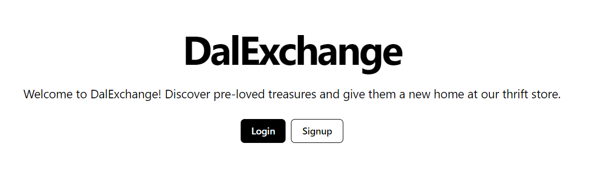
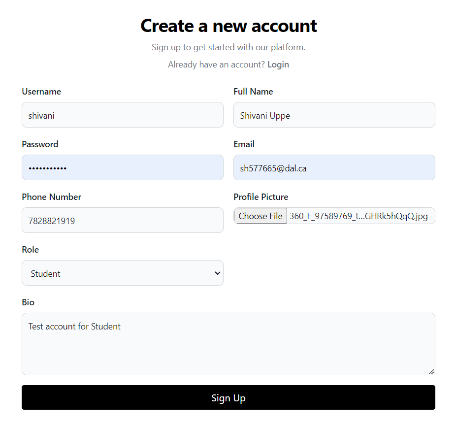
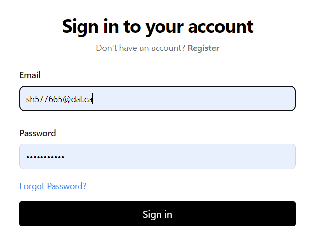
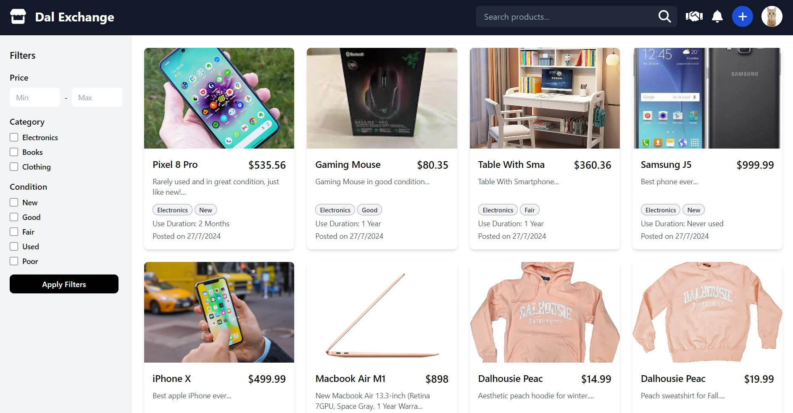
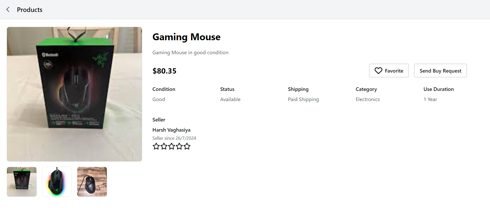

# DalExchange
## Overview
DalExchange is a web-based thrift store platform specifically designed for Dalhousie University students. This platform creates a convenient and secure marketplace for buying and selling second-hand items within the student community. By restricting access to Dalhousie students, DalExchange aims to foster a trusted environment where users can confidently exchange goods. Equipped with essential features to ensure a seamless user experience from product listing to payment processing and fulfillment, DalExchange offers a comprehensive solution for student-to-student transactions.

## Tools & Tech Stacks used : -
- [](https://spring.io/projects/spring-boot)
- 
- 
- 
- [](https://reactjs.org/)
- [](https://www.mysql.com/)
- [](https://about.gitlab.com/)

# Backend Setup
## Prerequisites

- **Java**
- **Spring Boot**
- **Maven**

## Dependencies 

| Dependency Group              | Description                                              | Artifact                       | Version    |
|-------------------------------|----------------------------------------------------------|--------------------------------|------------|
| org.springframework.boot      | Starter for building web, including RESTful, applications| spring-boot-starter-web        |            |
| org.springframework.boot      | Starter for using Spring Data JPA                        | spring-boot-starter-data-jpa   |            |
| org.springframework.boot      | Starter for using Spring Security                        | spring-boot-starter-security   |            |
| org.springframework.boot      | Starter for using Spring Boot's validation support       | spring-boot-starter-validation |            |
| org.springframework.boot      | Starter for using Spring Boot's email support            | spring-boot-starter-mail       |            |
| com.mysql                     | MySQL JDBC driver                                        | mysql-connector-j              |            |
| org.springframework.boot      | Spring Boot dev tools                                    | spring-boot-devtools           |            |
| com.h2database                | H2 in-memory database                                    | h2                             |            |
| org.projectlombok             | Lombok library for reducing boilerplate code             | lombok                         |            |
| jakarta.persistence           | Jakarta Persistence API                                  | jakarta.persistence-api        | 3.1.0      |
| jakarta.validation            | Jakarta Validation API                                   | jakarta.validation-api         | 3.0.2      |
| org.modelmapper               | Object mapping library                                   | modelmapper                    | 3.2.0      |
| org.springframework.boot      | Starter for testing Spring Boot applications             | spring-boot-starter-test       |            |
| junit                         | JUnit testing framework for Java                         | junit                          |            |
| org.springframework.security  | Spring Security Core                                     | spring-security-core           | 6.3.0      |
| org.springframework.security  | Spring Security Web                                      | spring-security-web            | 6.3.0      |
| org.springframework.security  | Spring Security Config                                   | spring-security-config         | 6.3.0      |
| com.cloudinary                | Cloudinary HTTP library                                  | cloudinary-http44              | 1.39.0     |
| io.jsonwebtoken               | Java JWT: JSON Web Token for Java                        | jjwt-api                       | 0.11.5     |
| io.jsonwebtoken               | Implementation of Java JWT                              | jjwt-impl                      | 0.11.5     |
| io.jsonwebtoken               | Jackson support for Java JWT                             | jjwt-jackson                   | 0.11.5     |
| org.mockito                   | Mocking framework for unit tests                         | mockito-core                   |            |
| org.mockito                   | Mockito JUnit Jupiter                                    | mockito-junit-jupiter          |            |
| org.junit.jupiter             | JUnit Jupiter                                            | junit-jupiter                  |            |
| com.stripe                    | Stripe API for Java                                      | stripe-java                    | 20.118.0   |
## Execution
Steps to run the project locally:

### 1. Clone the repository

```bash
git clone https://git.cs.dal.ca/courses/2024-summer/csci-5308/group09.git
```

### 2. Navigate to backend folder

```bash
Navigate to group09/backend
```

### 3. Build the project

```bash
mvn clean install
```

### 3. Run the application 

```bash
mvn spring-boot:run
```
Finally, the application backend will start running locally.
# Frontend Setup
## Prerequisites

- **NodeJS**
- **npm**


## Dependencies

| Dependency Group                | Description                                       | Artifact                      | Version   |
|---------------------------------|---------------------------------------------------|-------------------------------|-----------|
| @stripe/react-stripe-js         | React components for Stripe integration           | @stripe/react-stripe-js       | 2.7.3    |
| @stripe/stripe-js               | Stripe.js library for the Stripe API               | @stripe/stripe-js             | 4.1.0    |
| @testing-library/jest-dom       | Custom jest matchers to test the state of the DOM  | @testing-library/jest-dom     | 5.17.0   |
| @testing-library/react          | Simple and complete React DOM testing utilities    | @testing-library/react        | 13.4.0   |
| @testing-library/user-event     | Fire events the same way the user does             | @testing-library/user-event   | 13.5.0   |
| axios                           | Promise based HTTP client for the browser and node.js | axios                         | 1.7.2    |
| chart.js                        | Simple yet flexible JavaScript charting library    | chart.js                      | 4.4.3    |
| react                           | JavaScript library for building user interfaces    | react                         | 18.3.1   |
| react-chartjs-2                 | React wrapper for Chart.js                         | react-chartjs-2               | 5.2.0    |
| react-dom                       | React package for working with the DOM             | react-dom                     | 18.3.1   |
| react-hot-toast                 | Smoking hot React notifications                    | react-hot-toast               | 2.4.1    |
| react-router-dom                | Declarative routing for React                      | react-router-dom              | 6.23.1   |
| react-scripts                   | Configuration and scripts for Create React App     | react-scripts                 | 5.0.1    |
| recharts                        | Redefined chart library built with React and D3    | recharts                      | 2.12.7   |
| stripe                          | Stripe API for Node.js                             | stripe                        | 16.5.0   |
| styled-components               | Visual primitives for the component age            | styled-components             | 6.1.12   |
| tailwindcss                     | A utility-first CSS framework                      | tailwindcss                   | 3.4.4    |
| tailwindcss-animate             | Tailwind CSS plugin for animations                 | tailwindcss-animate           | 1.0.7    |


# Walkthrough
## Landing page
Via the homepage, you can either login or signup.



## Account Registration


Once registered, the user will be asked to verify in order to authenticate.

## Login
User can login via valid credentials used in previous steps.



## Homepage

Once logged in, all the product listing are displayed over here along with wide range of filtering options.


## Product Details
User can view the preferred product details and also  wishlist any product they like.




