# DalExchange

## Overview
DalExchange is a web-based thrift store platform specifically designed for Dalhousie University students. This platform creates a convenient and secure marketplace for buying and selling second-hand items within the student community. By restricting access to Dalhousie students, DalExchange aims to foster a trusted environment where users can confidently exchange goods. Equipped with essential features to ensure a seamless user experience from product listing to payment processing and fulfillment, DalExchange offers a comprehensive solution for student-to-student transactions.

## Tech Stack 
- [](https://spring.io/projects/spring-boot)
- 
- 
- 
- [](https://reactjs.org/)
- [](https://www.mysql.com/)
- [](https://about.gitlab.com/)

# Backend Setup

## Prerequisite
- **Java**
- **Spring Boot**
- **Maven**

## Dependencies 
| Dependency Group              | Description                                              | Artifact                       | Version    |
|-------------------------------|----------------------------------------------------------|--------------------------------|------------|
| org.springframework.boot      | Starter for building web, including RESTful, applications| spring-boot-starter-web        |            |
| org.springframework.boot      | Starter for using Spring Data JPA                        | spring-boot-starter-data-jpa   |            |
| org.springframework.boot      | Starter for using Spring Security                        | spring-boot-starter-security   |            |
| org.springframework.boot      | Starter for using Spring Boot's validation support       | spring-boot-starter-validation |            |
| org.springframework.boot      | Starter for using Spring Boot's email support            | spring-boot-starter-mail       |            |
| com.mysql                     | MySQL JDBC driver                                        | mysql-connector-j              |            |
| org.springframework.boot      | Spring Boot dev tools                                    | spring-boot-devtools           |            |
| com.h2database                | H2 in-memory database                                    | h2                             |            |
| org.projectlombok             | Lombok library for reducing boilerplate code             | lombok                         |            |
| jakarta.persistence           | Jakarta Persistence API                                  | jakarta.persistence-api        | 3.1.0      |
| jakarta.validation            | Jakarta Validation API                                   | jakarta.validation-api         | 3.0.2      |
| org.modelmapper               | Object mapping library                                   | modelmapper                    | 3.2.0      |
| org.springframework.boot      | Starter for testing Spring Boot applications             | spring-boot-starter-test       |            |
| junit                         | JUnit testing framework for Java                         | junit                          |            |
| org.springframework.security  | Spring Security Core                                     | spring-security-core           | 6.3.0      |
| org.springframework.security  | Spring Security Web                                      | spring-security-web            | 6.3.0      |
| org.springframework.security  | Spring Security Config                                   | spring-security-config         | 6.3.0      |
| com.cloudinary                | Cloudinary HTTP library                                  | cloudinary-http44              | 1.39.0     |
| io.jsonwebtoken               | Java JWT: JSON Web Token for Java                        | jjwt-api                       | 0.11.5     |
| io.jsonwebtoken               | Implementation of Java JWT                              | jjwt-impl                      | 0.11.5     |
| io.jsonwebtoken               | Jackson support for Java JWT                             | jjwt-jackson                   | 0.11.5     |
| org.mockito                   | Mocking framework for unit tests                         | mockito-core                   |            |
| org.mockito                   | Mockito JUnit Jupiter                                    | mockito-junit-jupiter          |            |
| org.junit.jupiter             | JUnit Jupiter                                            | junit-jupiter                  |            |
| com.stripe                    | Stripe API for Java                                      | stripe-java                    | 20.118.0   |

## Execution
Steps to run the project locally:

### 1. Clone the repository

```bash
git clone https://git.cs.dal.ca/courses/2024-summer/csci-5308/group09.git
```

### 2. Navigate to backend folder

```bash
Navigate to group09/backend
```

### 3. Build the project

```bash
mvn clean install
```

### 3. Run the application 

```bash
mvn spring-boot:run
```
Finally, the application backend will start running locally.

# Frontend Setup

## Prerequisite
- **NodeJS**
- **npm**

## Dependencies

| Dependency Group                | Description                                       | Artifact                      | Version   |
|---------------------------------|---------------------------------------------------|-------------------------------|-----------|
| @stripe/react-stripe-js         | React components for Stripe integration           | @stripe/react-stripe-js       | 2.7.3    |
| @stripe/stripe-js               | Stripe.js library for the Stripe API               | @stripe/stripe-js             | 4.1.0    |
| @testing-library/jest-dom       | Custom jest matchers to test the state of the DOM  | @testing-library/jest-dom     | 5.17.0   |
| @testing-library/react          | Simple and complete React DOM testing utilities    | @testing-library/react        | 13.4.0   |
| @testing-library/user-event     | Fire events the same way the user does             | @testing-library/user-event   | 13.5.0   |
| axios                           | Promise based HTTP client for the browser and node.js | axios                         | 1.7.2    |
| chart.js                        | Simple yet flexible JavaScript charting library    | chart.js                      | 4.4.3    |
| react                           | JavaScript library for building user interfaces    | react                         | 18.3.1   |
| react-chartjs-2                 | React wrapper for Chart.js                         | react-chartjs-2               | 5.2.0    |
| react-dom                       | React package for working with the DOM             | react-dom                     | 18.3.1   |
| react-hot-toast                 | Smoking hot React notifications                    | react-hot-toast               | 2.4.1    |
| react-router-dom                | Declarative routing for React                      | react-router-dom              | 6.23.1   |
| react-scripts                   | Configuration and scripts for Create React App     | react-scripts                 | 5.0.1    |
| recharts                        | Redefined chart library built with React and D3    | recharts                      | 2.12.7   |
| stripe                          | Stripe API for Node.js                             | stripe                        | 16.5.0   |
| styled-components               | Visual primitives for the component age            | styled-components             | 6.1.12   |
| tailwindcss                     | A utility-first CSS framework                      | tailwindcss                   | 3.4.4    |
| tailwindcss-animate             | Tailwind CSS plugin for animations                 | tailwindcss-animate           | 1.0.7    |

# Walkthrough

## Landing page
Via the homepage, you can either login or signup.


## Account Registration


Once registered, the user will be asked to verify in order to authenticate.

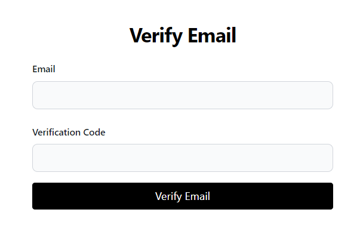

## Login
User can login via valid credentials used in previous steps.


## Homepage
Once logged in, all the product listing are displayed along with wide range of filtering options.


## Product Details
User can view the preferred product details and also wishlist any product they like.

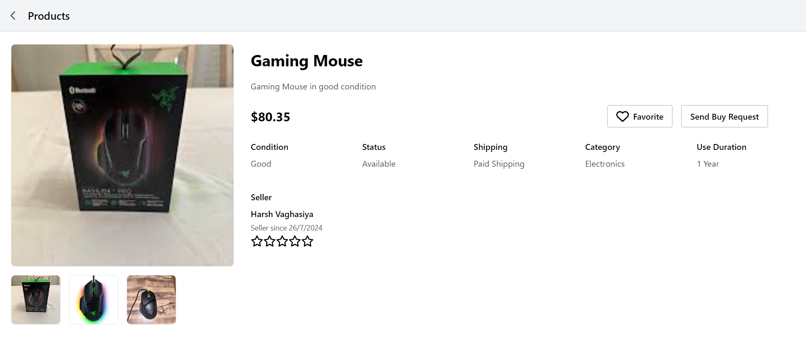

## Trade Request
User can send buy request for the products they like.


Seller will recieve the request and can accept or reject the proposal.

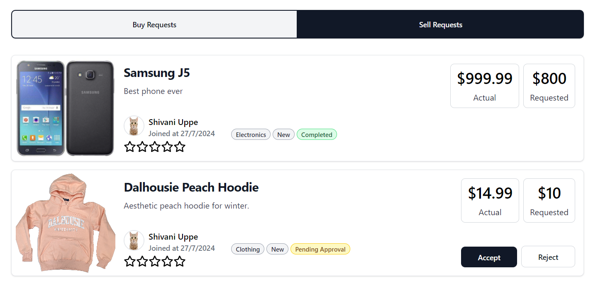

## Notification
Users can also view all the requests messages in Notifictions section.

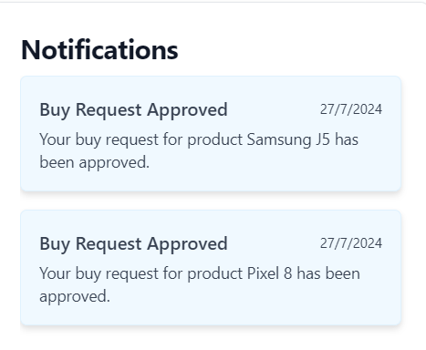

## Payment Transaction
Once the seller accept the proposal, the user has to enter the shipping address.


 The customer can initiate a payment using Stripe payment gateway.

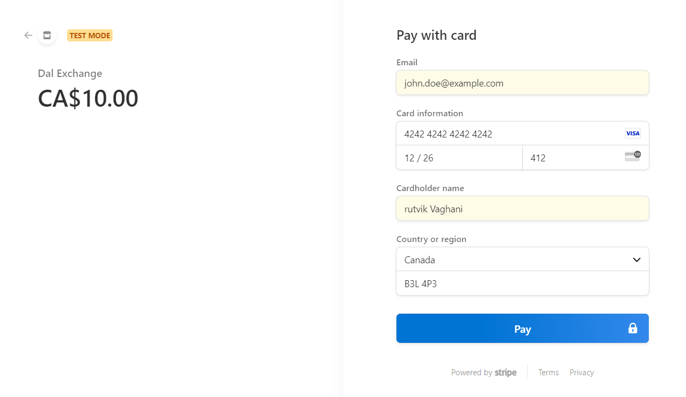

## Rating/Review
Once the payment is successful. the user can leave a review/rating according to their convenience.

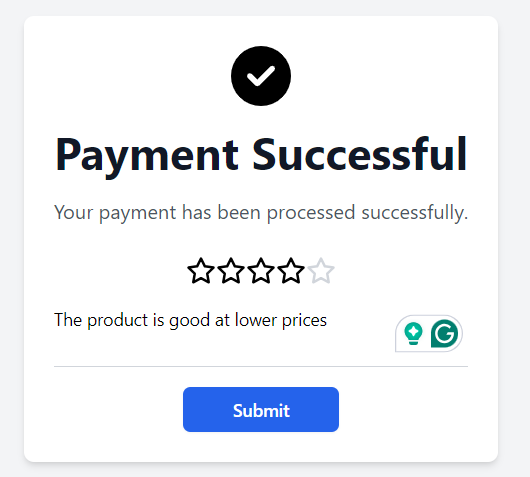

## Add Product
Users can also sell their own products with easy to add form.


## Profile Page
Using profile section, user can view wishlisted products, purchase history, items sold by them and also the reviews published.

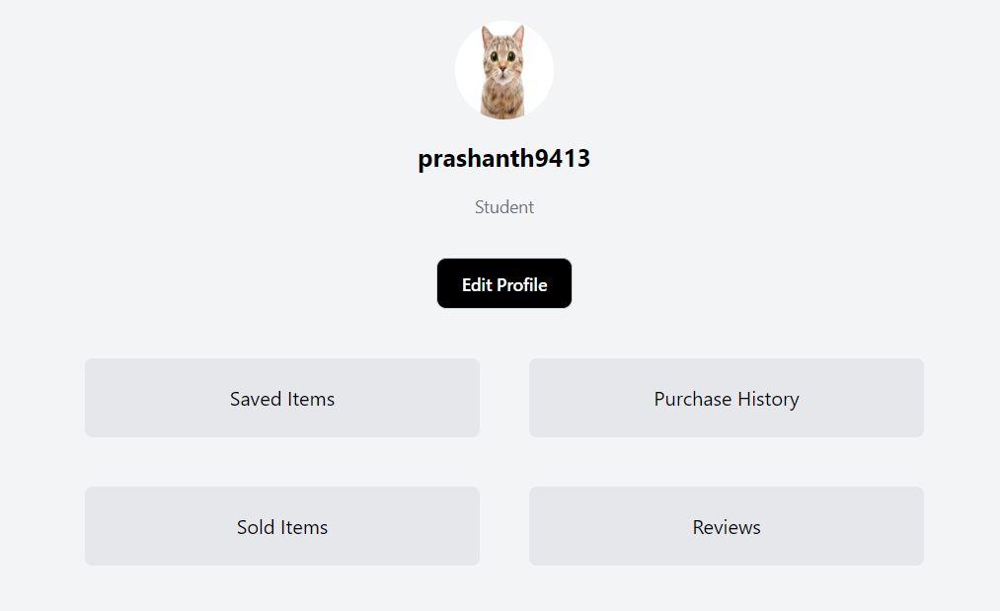

**1) Edit Profile:**


**2) Wishlist:**


**3) Purchase History:**


**4) Sold Items:**


**5) Reviews:**


# Admin Moderation
Admin can edit all the essential details and act as a customer support to help users out with their queries and also to check overall statistics.

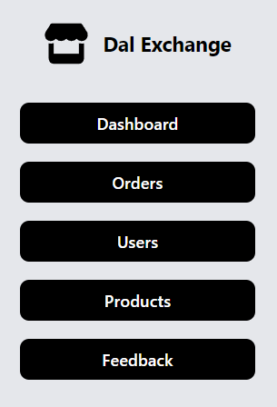

## Admin Dashboard
Admin can view comprehensive statistics, compare metrics between the current and previous months, and analyze trends for better decision-making.

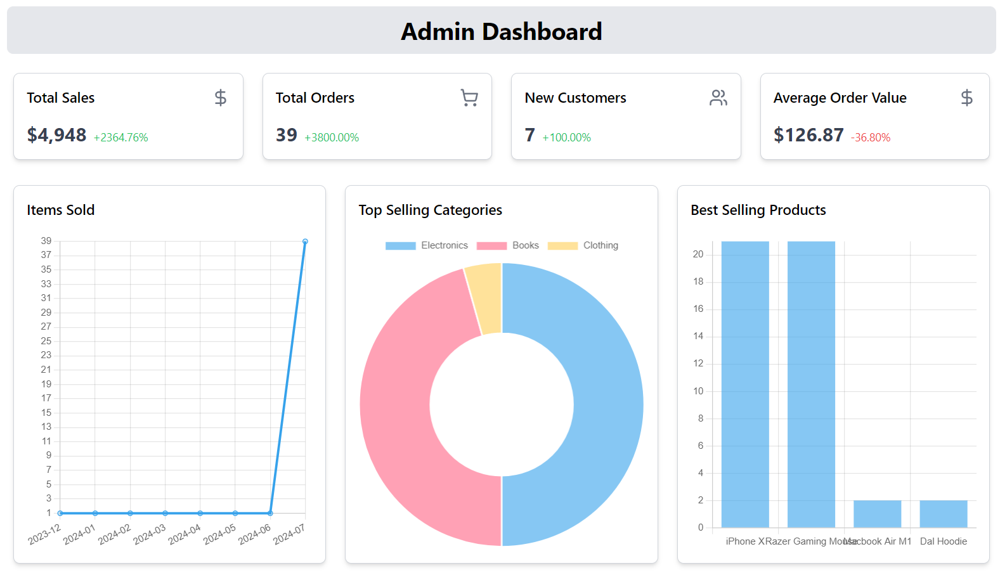

## Order Moderation
All the orders can be viewed at once and be edited whenever needed.

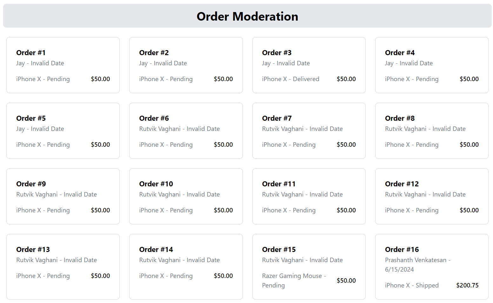

All the necessary fields can be edited and also the admin can refund a order in case of a scam.


## User Moderation
Admin can view all the users and edit any details if required.

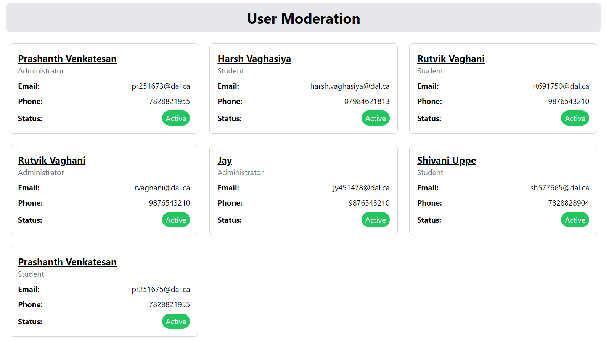

Admin can also delete and deactivate a certain account if it doesn't comply with the rules.

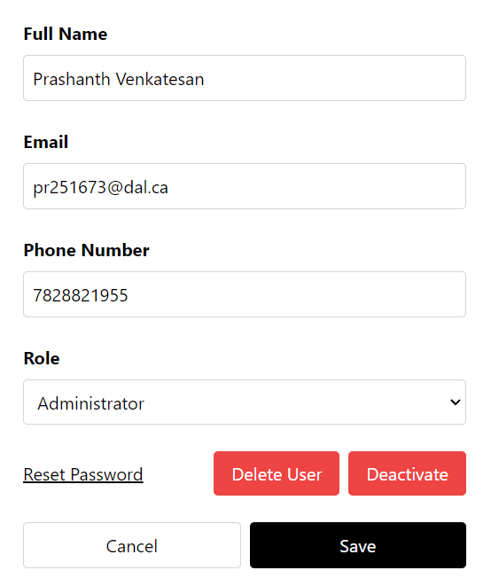

## Product Moderation
Admin can view all the products (including unlisted ones).

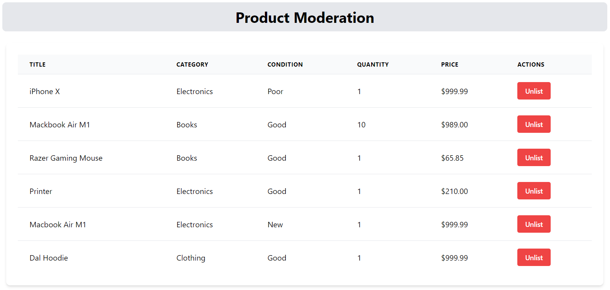

Admin can edit any details and also unlist any product which doesn't comply with company guidelines.

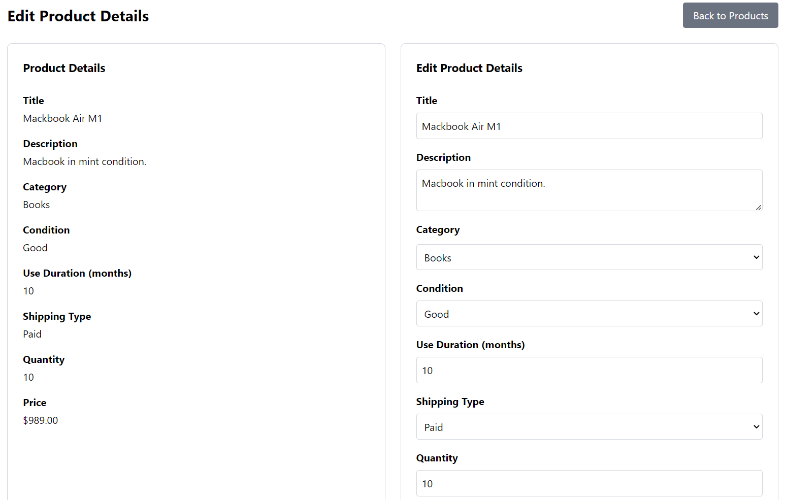

## Feedback Moderation
Admin can view all feedback segregated based on products.


Admin cannot edit the feedback, but can delete it if the comment is offensive.


# Adherence to SOLID Principles
## Single Responsibility Principle
We have ensured that each class executes single functionality rather than managing mutiple things altogether

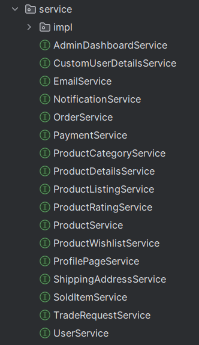

## Open/Closed Principle
We have ensured that all the class can be extended by adding new methods for new functionalities without modifying existing code. 

For example, new methods can be added for additional product operations without altering the current methods.

## Liskov Substitution Principle
We have made sure that objects of a superclass is replaceable with objects of a subclass without affecting the functionality of the program.

For example: 
The Mapper interface can have multiple implementations (ProductMapperImpl, ProductModerationMapperImpl), and these implementations can be used interchangeably without affecting the functionality.


## Interface Segregation Principle
Instead of having one large interface, we divided it into multiple smaller, specific-purpose interfaces. This way, clients only need to know about the methods that are of interest to them.


## Dependency Inversion Principle

While building the application, we ensured that high-level modules should not depend on low-level modules. Both should depend on abstractions.

Using @Autowired in Spring to inject dependencies allows us to depend on abstractions rather than concrete implementations.

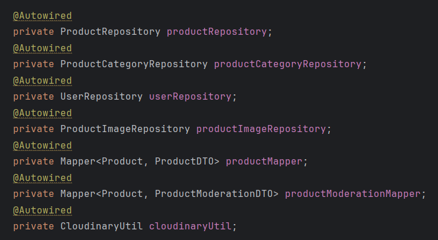